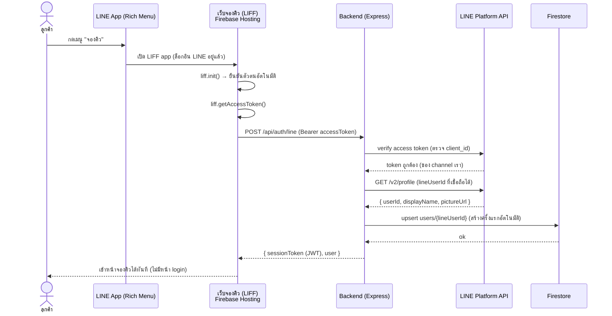

# การเข้าสู่ระบบอัตโนมัติของลูกค้าผ่าน LINE (LIFF Auto-Login)

**เป้าหมาย:** ลูกค้าไม่ต้องล็อกอินซ้ำซ้อน — กด Rich Menu ในไลน์แล้วเข้าเว็บจองคิวได้ทันที
ระบบเชื่อม LINE กับเว็บแอปพลิเคชันโดยอัตโนมัติผ่าน **LIFF (LINE Front-end Framework)**

> ลูกค้า = ไม่มีหน้า login / ไม่มีการสมัครสมาชิก (ยืนยันตัวตนผ่าน LINE อัตโนมัติ)
> ผู้ดูแลร้าน = ล็อกอินเว็บด้วย username/password + JWT (เหมือนเดิม)

---

## หลักการทำงาน
เมื่อลูกค้าเปิดเว็บจองคิว**จากภายในแอป LINE** (ผ่าน Rich Menu / ลิงก์ใน LINE OA) หน้าเว็บนั้นเป็น **LIFF app** ซึ่ง `liff.init()` จะยืนยันตัวตนให้อัตโนมัติ เพราะผู้ใช้ล็อกอิน LINE อยู่แล้ว จึงได้ `lineUserId`, `displayName`, `pictureUrl` มาทันทีโดยไม่มีหน้าล็อกอิน

**สำคัญด้านความปลอดภัย:** ห้ามเชื่อ `lineUserId` ที่ส่งจาก client ตรง ๆ (ปลอมได้)
Backend ต้อง **ยืนยัน access token กับเซิร์ฟเวอร์ LINE ก่อน** ว่า token ออกให้ channel ของเราจริง แล้วค่อยเชื่อถือ `lineUserId`

---

## ลำดับการทำงาน (Sequence)


---

## โค้ดฝั่งหน้าเว็บ (LIFF)
```js
import liff from '@line/liff';

async function initCustomer() {
  await liff.init({ liffId: import.meta.env.VITE_LIFF_ID });

  // เปิดจากในแอป LINE จะ logged-in อยู่แล้ว; เปิดจาก browser ภายนอกจึงค่อย login ครั้งเดียว
  if (!liff.isLoggedIn()) {
    liff.login();          // redirect ไปหน้า LINE login แล้วกลับมา (เกิดเฉพาะนอกแอป LINE)
    return;
  }

  const accessToken = liff.getAccessToken();
  const res = await fetch('/api/auth/line', {
    method: 'POST',
    headers: { Authorization: `Bearer ${accessToken}` },
  });
  const { sessionToken, user } = await res.json();
  localStorage.setItem('session', sessionToken);   // ใช้เรียก API จองคิวต่อ
  return user;                                       // { id, name } เข้าหน้าจองได้เลย
}
```

## โค้ดฝั่ง Backend (Express) — ยืนยัน token + upsert อัตโนมัติ
```js
const jwt = require('jsonwebtoken');
const { getFirestore, FieldValue } = require('firebase-admin/firestore');
const db = getFirestore();

app.post('/api/auth/line', async (req, res) => {
  const accessToken = (req.headers.authorization || '').split(' ')[1];
  if (!accessToken) return res.status(401).json({ error: 'no token' });

  // 1) ยืนยันว่า access token ออกให้ channel ของเราจริง (กันปลอม)
  const verify = await fetch(
    `https://api.line.me/oauth2/v2.1/verify?access_token=${accessToken}`
  ).then(r => r.json());
  if (verify.client_id !== process.env.LINE_LOGIN_CHANNEL_ID) {
    return res.status(401).json({ error: 'invalid token' });
  }

  // 2) ดึงโปรไฟล์ -> lineUserId ที่เชื่อถือได้
  const profile = await fetch('https://api.line.me/v2/profile', {
    headers: { Authorization: `Bearer ${accessToken}` },
  }).then(r => r.json());
  const lineUserId = profile.userId;

  // 3) upsert user (สร้างอัตโนมัติครั้งแรก — ไม่มีหน้า signup)
  const ref = db.collection('users').doc(lineUserId);   // docId = lineUserId
  const snap = await ref.get();
  if (!snap.exists) {
    await ref.set({
      role: 'customer',
      fullName: profile.displayName,
      pictureUrl: profile.pictureUrl || null,
      lineUserId,
      phone: null, username: null, passwordHash: null,
      createdAt: FieldValue.serverTimestamp(),
    });
  }

  // 4) ออก session JWT ให้เว็บใช้เรียก API จองคิวต่อ
  const sessionToken = jwt.sign(
    { uid: lineUserId, role: 'customer' },
    process.env.JWT_SECRET, { expiresIn: '7d' }
  );
  res.json({ sessionToken, user: { id: lineUserId, name: profile.displayName } });
});
```

---

## ผลต่อการออกแบบระบบ
1. **users collection:** เอกสารของลูกค้าใช้ **docId = lineUserId** (upsert ได้ทันที ไม่ซ้ำ) ส่วนแอดมินใช้ docId แยก (เช่น user_admin)
2. **ไม่มีฟังก์ชัน "สมัครสมาชิก/เข้าสู่ระบบ" ฝั่งลูกค้า** — ต้องแก้ขอบเขตบท 1 ข้อ 1.5.2.1 จาก "สามารถสมัครสมาชิก เข้าสู่ระบบ..." เป็น "เข้าถึงระบบอัตโนมัติผ่าน LINE โดยไม่ต้องสมัครสมาชิกหรือล็อกอินซ้ำ"
3. **ต้องใช้ 2 channel ใน LINE Developers:** Messaging API channel (webhook/แจ้งเตือน) + LINE Login channel (ผูกกับ LIFF) — ทั้งคู่อยู่ใน provider เดียวกันได้
4. **ความปลอดภัย (จุดพูดตอน present):** ยืนยัน access token ฝั่ง server เสมอ ไม่เชื่อ userId จาก client → กัน identity spoofing
